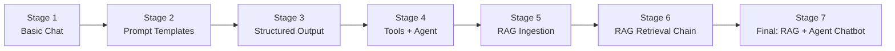
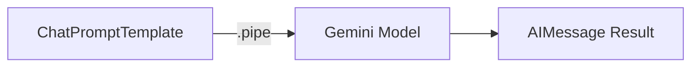
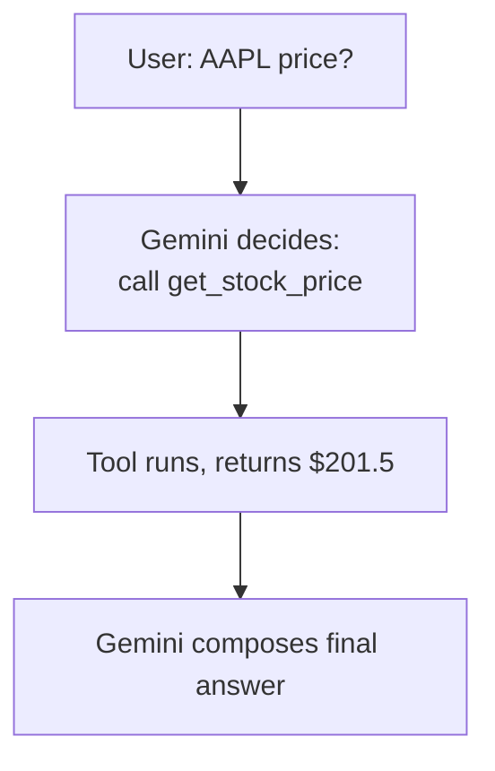
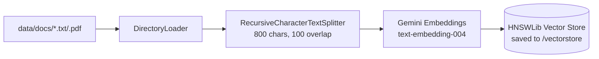
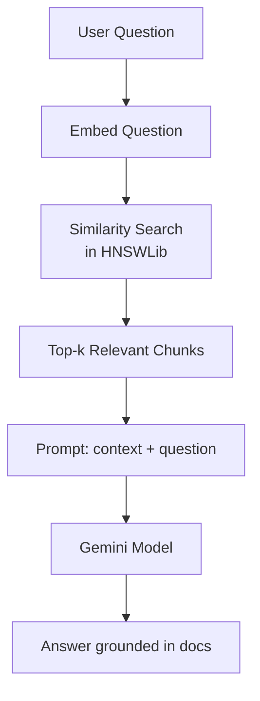
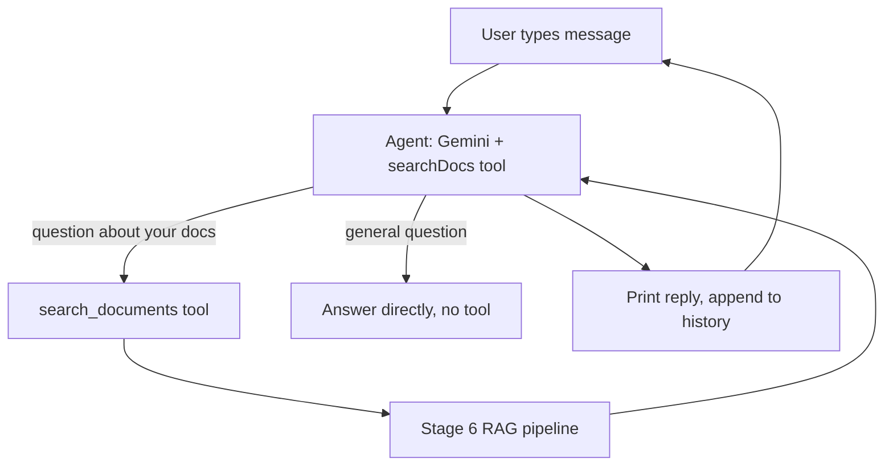

# Project: "DocBot" — Learn LangChain + RAG with Gemini (TypeScript)

A single progressively-built project that takes you from "hello LLM" all the way
to a working **RAG chatbot with tools**, using **Gemini API** as the model provider.

Each stage is its own runnable file, so you can run and understand one concept
at a time before combining everything into the final chatbot.



---

## 0. Prerequisites

1. **Node.js 20+** installed (`node -v` to check).
2. A **Gemini API key** — get one free at https://aistudio.google.com/app/apikey
3. Basic TypeScript familiarity (you already know enough).

---

## 1. Project Folder Structure

Create this structure first — we'll fill in each file stage by stage.

```
docbot/
├── src/
│   ├── config.ts                  # Shared model/embeddings setup
│   ├── 01-basic-chat.ts           # Stage 1
│   ├── 02-prompt-template.ts      # Stage 2
│   ├── 03-structured-output.ts    # Stage 3
│   ├── 04-tool-agent.ts           # Stage 4
│   ├── rag/
│   │   ├── ingest.ts              # Stage 5: load, split, embed, store
│   │   └── retrieve.ts            # Stage 6: query the vector store
│   └── chatbot.ts                 # Stage 7: final combined CLI app
├── data/
│   └── docs/                      # <-- put your .txt / .pdf files here
├── vectorstore/                   # auto-generated local vector DB (HNSWLib)
├── .env
├── package.json
└── tsconfig.json
```

```bash
mkdir -p docbot/src/rag docbot/data/docs docbot/vectorstore
cd docbot
```

---

## 2. Initialize the Project

```bash
npm init -y
npm install typescript tsx @types/node --save-dev
npx tsc --init
```

**`tsconfig.json`** — replace contents with:

```json
{
  "compilerOptions": {
    "target": "ES2022",
    "module": "ESNext",
    "moduleResolution": "Bundler",
    "esModuleInterop": true,
    "strict": true,
    "skipLibCheck": true,
    "outDir": "dist"
  },
  "include": ["src"]
}
```

**`package.json`** — add `"type": "module"` and a `dev` script:

```json
{
  "type": "module",
  "scripts": {
    "dev": "tsx"
  }
}
```

> From now on you run any file with: `npm run dev src/<file>.ts`

---

## 3. Install LangChain + Gemini Dependencies

```bash
npm install langchain @langchain/core @langchain/google-genai zod dotenv
npm install @langchain/community @langchain/textsplitters hnswlib-node pdf-parse
```

| Package                     | Why                                         |
|------------------------------|----------------------------------------------|
| `langchain`                  | Core framework, `createAgent`, tools         |
| `@langchain/core`            | Base abstractions (messages, prompts, runnables) |
| `@langchain/google-genai`    | Gemini chat model + embeddings               |
| `zod`                        | Schemas for structured output / tool args    |
| `@langchain/community`       | Document loaders, HNSWLib vector store       |
| `@langchain/textsplitters`   | Chunking documents for RAG                   |
| `hnswlib-node`               | Local, file-based vector store (no DB server needed) |
| `pdf-parse`                  | Lets the PDF loader read PDF files           |

**`.env`**:

```
GEMINI_API_KEY=your_key_here
```

---

## 4. Shared Config

**`src/config.ts`**

```ts
import "dotenv/config";
import { ChatGoogleGenerativeAI } from "@langchain/google-genai";
import { GoogleGenerativeAIEmbeddings } from "@langchain/google-genai";

if (!process.env.GEMINI_API_KEY) {
  throw new Error("Missing GEMINI_API_KEY in .env");
}

export function createChatModel(temperature = 0.3) {
  return new ChatGoogleGenerativeAI({
    apiKey: process.env.GEMINI_API_KEY,
    model: "gemini-2.5-flash",
    temperature,
  });
}

export function createEmbeddings() {
  return new GoogleGenerativeAIEmbeddings({
    apiKey: process.env.GEMINI_API_KEY,
    model: "text-embedding-004",
  });
}
```

---

## Stage 1 — Basic Chat Call

Goal: confirm Gemini + LangChain are wired up correctly.

**`src/01-basic-chat.ts`**

```ts
import { createChatModel } from "./config.js";

const model = createChatModel();

const response = await model.invoke("In one sentence, what is RAG in AI?");
console.log(response.content);
```

```bash
npm run dev src/01-basic-chat.ts
```

---

## Stage 2 — Prompt Templates

Goal: stop hardcoding strings; learn parameterized prompts.

**`src/02-prompt-template.ts`**

```ts
import { ChatPromptTemplate } from "@langchain/core/prompts";
import { createChatModel } from "./config.js";

const model = createChatModel();

const prompt = ChatPromptTemplate.fromMessages([
  ["system", "You are a {persona}. Keep answers under 3 sentences."],
  ["human", "Explain {topic} simply."],
]);

const chain = prompt.pipe(model);

const result = await chain.invoke({
  persona: "patient programming tutor",
  topic: "vector embeddings",
});

console.log(result.content);
```



```bash
npm run dev src/02-prompt-template.ts
```

---

## Stage 3 — Structured Output (Zod)

Goal: get reliable, typed JSON back instead of free text.

**`src/03-structured-output.ts`**

```ts
import { z } from "zod";
import { createChatModel } from "./config.js";

const model = createChatModel();

const ReviewSchema = z.object({
  sentiment: z.enum(["positive", "negative", "neutral"]),
  summary: z.string(),
  rating: z.number().min(1).max(5),
});

const structuredModel = model.withStructuredOutput(ReviewSchema);

const result = await structuredModel.invoke(
  "This laptop is fast and the screen is gorgeous, but the battery dies too quickly."
);

console.log(result);
// { sentiment: 'neutral', summary: '...', rating: 3 }
```

```bash
npm run dev src/03-structured-output.ts
```

---

## Stage 4 — Tools + Agent

Goal: let the model decide to call a function and use its result.

**`src/04-tool-agent.ts`**

```ts
import { tool } from "langchain";
import { createAgent } from "langchain";
import { z } from "zod";
import { createChatModel } from "./config.js";

const getStockPrice = tool(
  async ({ ticker }: { ticker: string }) => {
    // mocked — swap with a real API call
    const fakePrices: Record<string, number> = { AAPL: 201.5, GOOGL: 178.2 };
    return `${ticker} is trading at $${fakePrices[ticker] ?? "unknown"}`;
  },
  {
    name: "get_stock_price",
    description: "Get the current stock price for a ticker symbol",
    schema: z.object({ ticker: z.string().describe("e.g. AAPL") }),
  }
);

const agent = createAgent({
  model: createChatModel(0),
  tools: [getStockPrice],
  prompt: "You are a concise financial assistant.",
});

const result = await agent.invoke({
  messages: [{ role: "user", content: "What's AAPL trading at right now?" }],
});

console.log(result.messages.at(-1)?.content);
```



```bash
npm run dev src/04-tool-agent.ts
```

---

## Stage 5 — RAG: Ingest Your Documents

Drop a few `.txt` or `.pdf` files into `data/docs/` first (e.g. a resume,
a product manual, lecture notes — anything you want to "chat with").

**`src/rag/ingest.ts`**

```ts
import fs from "node:fs";
import path from "node:path";
import { DirectoryLoader } from "langchain/document_loaders/fs/directory";
import { TextLoader } from "langchain/document_loaders/fs/text";
import { PDFLoader } from "@langchain/community/document_loaders/fs/pdf";
import { RecursiveCharacterTextSplitter } from "@langchain/textsplitters";
import { HNSWLib } from "@langchain/community/vectorstores/hnswlib";
import { createEmbeddings } from "../config.js";

const DOCS_DIR = path.resolve("data/docs");
const STORE_DIR = path.resolve("vectorstore");

async function main() {
  console.log("Loading documents from", DOCS_DIR);

  const loader = new DirectoryLoader(DOCS_DIR, {
    ".txt": (filePath) => new TextLoader(filePath),
    ".pdf": (filePath) => new PDFLoader(filePath),
  });

  const rawDocs = await loader.load();
  console.log(`Loaded ${rawDocs.length} document(s)`);

  const splitter = new RecursiveCharacterTextSplitter({
    chunkSize: 800,
    chunkOverlap: 100,
  });
  const chunks = await splitter.splitDocuments(rawDocs);
  console.log(`Split into ${chunks.length} chunks`);

  const embeddings = createEmbeddings();
  const vectorStore = await HNSWLib.fromDocuments(chunks, embeddings);

  fs.mkdirSync(STORE_DIR, { recursive: true });
  await vectorStore.save(STORE_DIR);

  console.log("Vector store saved to", STORE_DIR);
}

main();
```

```bash
npm run dev src/rag/ingest.ts
```



> Run this once whenever you add/change documents.

---

## Stage 6 — RAG: Retrieve + Answer

**`src/rag/retrieve.ts`**

```ts
import path from "node:path";
import { HNSWLib } from "@langchain/community/vectorstores/hnswlib";
import { ChatPromptTemplate } from "@langchain/core/prompts";
import { createChatModel, createEmbeddings } from "../config.js";

const STORE_DIR = path.resolve("vectorstore");

const RAG_PROMPT = ChatPromptTemplate.fromMessages([
  [
    "system",
    "Answer ONLY using the context below. If the answer isn't in the context, say you don't know.\n\nContext:\n{context}",
  ],
  ["human", "{question}"],
]);

export async function askDocs(question: string) {
  const vectorStore = await HNSWLib.load(STORE_DIR, createEmbeddings());
  const retriever = vectorStore.asRetriever({ k: 4 });

  const relevantDocs = await retriever.invoke(question);
  const context = relevantDocs.map((d) => d.pageContent).join("\n\n---\n\n");

  const model = createChatModel(0);
  const chain = RAG_PROMPT.pipe(model);

  const result = await chain.invoke({ context, question });
  return result.content;
}

// Allow running this file directly: npm run dev src/rag/retrieve.ts
if (process.argv[2]) {
  const answer = await askDocs(process.argv.slice(2).join(" "));
  console.log(answer);
}
```

```bash
npm run dev src/rag/retrieve.ts "What does my document say about refunds?"
```



---

## Stage 7 — Final: RAG-as-a-Tool Inside an Agent (CLI Chatbot)

This is the payoff: an agent that can **decide** whether to search your
documents or just answer directly — true *agentic RAG*.

**`src/chatbot.ts`**

```ts
import readline from "node:readline/promises";
import { tool } from "langchain";
import { createAgent } from "langchain";
import { z } from "zod";
import { createChatModel } from "./config.js";
import { askDocs } from "./rag/retrieve.js";

const searchDocs = tool(
  async ({ query }: { query: string }) => {
    return await askDocs(query);
  },
  {
    name: "search_documents",
    description:
      "Search the user's uploaded documents to answer questions about their specific content.",
    schema: z.object({ query: z.string() }),
  }
);

const agent = createAgent({
  model: createChatModel(0.2),
  tools: [searchDocs],
  prompt:
    "You are DocBot. Use search_documents only when the question is about " +
    "the user's personal documents. Otherwise answer normally.",
});

const rl = readline.createInterface({ input: process.stdin, output: process.stdout });
let history: { role: "user" | "assistant"; content: string }[] = [];

console.log("DocBot ready. Type 'exit' to quit.\n");

while (true) {
  const userInput = await rl.question("You: ");
  if (userInput.trim().toLowerCase() === "exit") break;

  history.push({ role: "user", content: userInput });

  const result = await agent.invoke({ messages: history });
  const reply = result.messages.at(-1)?.content as string;

  console.log("DocBot:", reply, "\n");
  history.push({ role: "assistant", content: reply });
}

rl.close();
```

```bash
npm run dev src/chatbot.ts
```



---

## 5. Run Order Summary

```bash
npm run dev src/01-basic-chat.ts          # sanity check Gemini works
npm run dev src/02-prompt-template.ts     # templated prompts
npm run dev src/03-structured-output.ts   # typed JSON output
npm run dev src/04-tool-agent.ts          # tool-calling agent
npm run dev src/rag/ingest.ts             # build the vector store (run once / after doc changes)
npm run dev src/rag/retrieve.ts "your question"  # test raw RAG
npm run dev src/chatbot.ts                # final combined chatbot
```

---

## 6. What You'll Understand After This Project

- How a **chat model call** actually works under the hood
- How **prompt templates** remove hardcoded strings
- How to force **typed, structured output** with Zod
- How a model **decides to call a tool** and uses the result
- The full **RAG pipeline**: load → split → embed → store → retrieve → augment → generate
- How to combine RAG **with an agent** so the model only searches docs when needed

## 7. Ideas to Extend It Further

- Swap `HNSWLib` for a hosted vector DB (Pinecone, Chroma, Postgres+pgvector)
- Add a second tool (e.g. web search) so the agent chooses between sources
- Add streaming (`agent.stream(...)`) for token-by-token CLI output
- Track citations: return which chunk/source each answer came from
- Wrap `chatbot.ts` in an Express API and build a small web UI on top