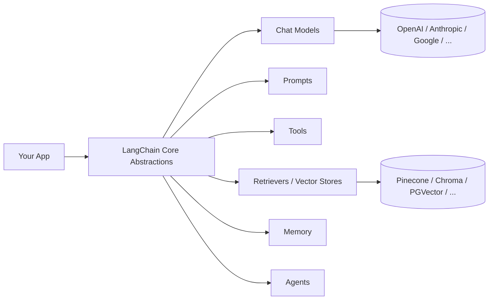
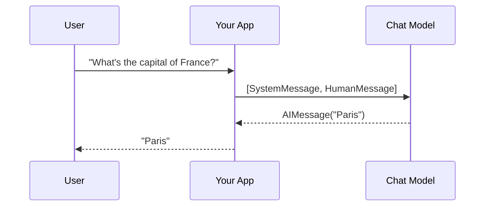
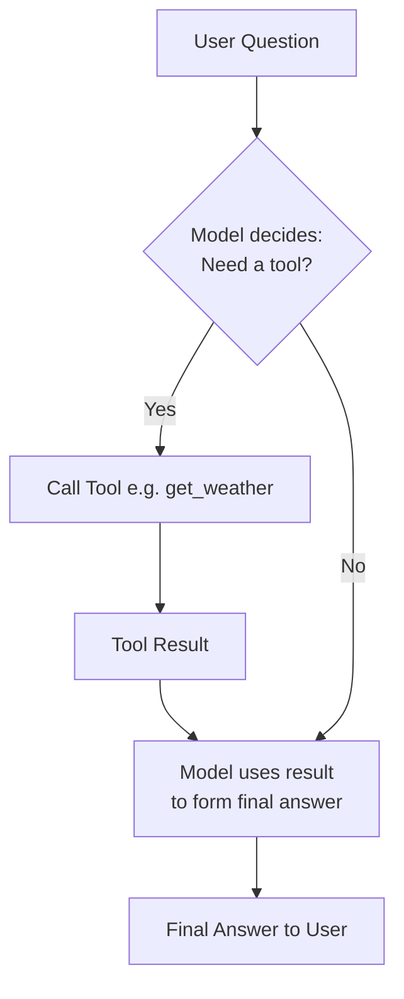
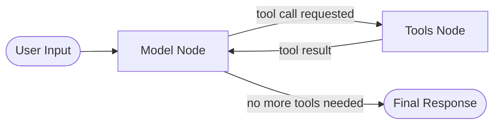
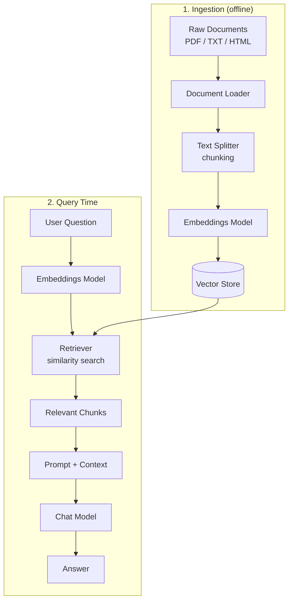
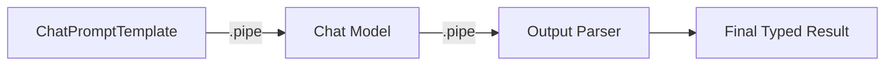
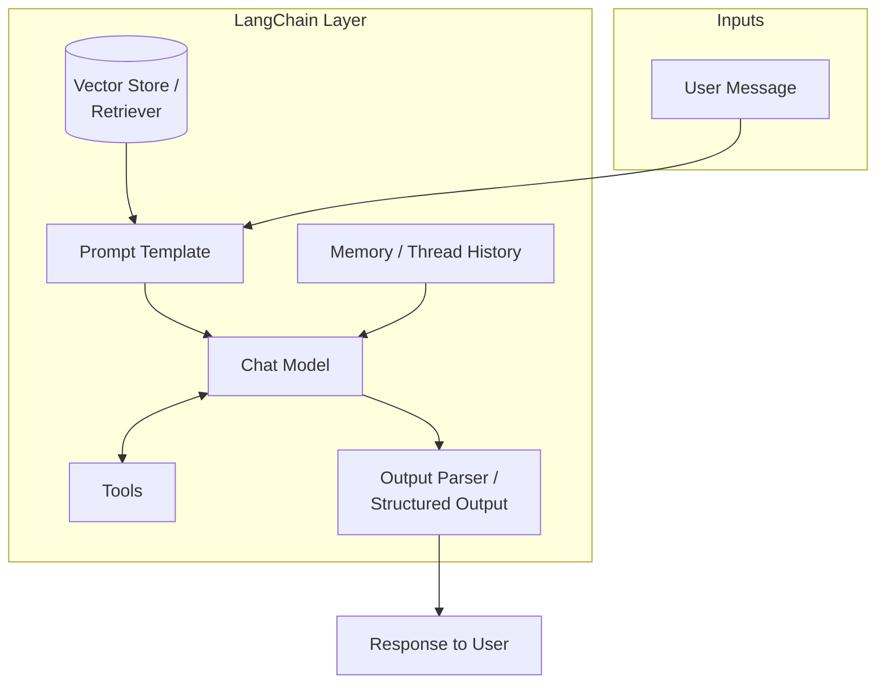

# LangChain (TypeScript) — Complete Reference Notes

> Scope: LangChain.js core framework only (no LangGraph, per request).
> Stable line: **v1.0+** (released Oct 2025). Requires **Node.js 20+**.

---

## 1. What is LangChain?

LangChain is an open-source framework for building applications powered by LLMs.
It gives you **standard, swappable interfaces** for models, prompts, tools, memory,
and retrieval — so you can build chatbots, RAG systems, and agents without
hand-wiring every provider's SDK.

Think of it as a **toolbox of interoperable Lego pieces**:



**Why use it instead of calling provider APIs directly?**
- One interface, many providers (swap OpenAI ↔ Anthropic ↔ Gemini with no rewrite)
- Built-in patterns for RAG, tool-calling agents, structured output
- A huge ecosystem of integrations (1000+) for vector stores, loaders, tools

---

## 2. Installation

```bash
npm install langchain @langchain/core
npm install @langchain/anthropic   # or @langchain/openai, @langchain/google-genai
```

```ts
// .env
ANTHROPIC_API_KEY=sk-ant-...
```

> Note: `create_agent`/`createAgent` runs on LangGraph's runtime under the hood,
> but you never have to write LangGraph code yourself to use it.

---

## 3. The Core Components

```mermaid
mindmap
  root((LangChain))
    Models
      Chat Models
      Embeddings
    Messages
      HumanMessage
      AIMessage
      SystemMessage
      ToolMessage
    Prompts
      PromptTemplate
      ChatPromptTemplate
    Output Parsers
      Structured Output (Zod)
    Tools
      tool()
      ToolRuntime
    Agents
      createAgent
      Middleware
    Memory
      Short-term (thread state)
    Retrieval (RAG)
      Document Loaders
      Text Splitters
      Vector Stores
      Retrievers
    Composition
      Runnable / LCEL
```

---

### 3.1 Chat Models

The unified interface to talk to any LLM provider.

```ts
import { ChatAnthropic } from "@langchain/anthropic";

const model = new ChatAnthropic({
  model: "claude-sonnet-4-6",
  temperature: 0.7,
});

const response = await model.invoke("Explain LangChain in one sentence.");
console.log(response.content);
```

Swapping providers is just swapping the import + class:

```ts
import { ChatOpenAI } from "@langchain/openai";
const model = new ChatOpenAI({ model: "gpt-5.4" });
```

---

### 3.2 Messages

Conversations are arrays of typed message objects — this is how chat history
and roles are represented.

```ts
import { HumanMessage, SystemMessage, AIMessage } from "@langchain/core/messages";

const messages = [
  new SystemMessage("You are a helpful assistant."),
  new HumanMessage("What's the capital of France?"),
];

const response = await model.invoke(messages);
// response is an AIMessage
```

| Message Type      | Role                                  |
|--------------------|----------------------------------------|
| `SystemMessage`    | Instructions / persona for the model   |
| `HumanMessage`     | User input                             |
| `AIMessage`        | Model's reply                          |
| `ToolMessage`      | Result returned from a tool call       |



---

### 3.3 Prompt Templates

Reusable, parameterized prompts — avoids messy string concatenation.

```ts
import { ChatPromptTemplate } from "@langchain/core/prompts";

const prompt = ChatPromptTemplate.fromMessages([
  ["system", "You are an expert {domain} tutor."],
  ["human", "Explain {topic} to a beginner."],
]);

const formatted = await prompt.invoke({
  domain: "biology",
  topic: "mitochondria",
});

const response = await model.invoke(formatted);
```

---

### 3.4 Output Parsers / Structured Output

Force the model to return predictable, typed data instead of free text —
defined with **Zod** schemas in TypeScript.

```ts
import { z } from "zod";

const ContactSchema = z.object({
  name: z.string(),
  email: z.string().email(),
  intent: z.enum(["sales", "support", "other"]),
});

const structuredModel = model.withStructuredOutput(ContactSchema);

const result = await structuredModel.invoke(
  "Hi, I'm Asha (asha@example.com), I need help with billing."
);
// result is fully typed: { name, email, intent }
```

---

### 3.5 Tools

Functions the model can choose to call to fetch data or take action
(weather lookups, DB queries, calculators, API calls, etc.)

```ts
import { tool } from "langchain";
import { z } from "zod";

const getWeather = tool(
  async ({ city }) => {
    return `It's 28°C and sunny in ${city}.`;
  },
  {
    name: "get_weather",
    description: "Get current weather for a city",
    schema: z.object({ city: z.string() }),
  }
);
```



---

### 3.6 Agents (`createAgent`)

An **agent** is a model + a set of tools that loops: *think → act → observe*
until it has a final answer. This is LangChain's "ReAct"-style harness.

```ts
import { createAgent } from "langchain";
import { ChatAnthropic } from "@langchain/anthropic";

const agent = createAgent({
  model: new ChatAnthropic({ model: "claude-sonnet-4-6" }),
  tools: [getWeather],
  prompt: "You are a helpful travel assistant.",
});

const result = await agent.invoke({
  messages: [{ role: "user", content: "Should I bring an umbrella in Chennai today?" }],
});

console.log(result.messages.at(-1)?.content);
```

**The agent loop, visualized:**



#### Middleware

Hooks to customize agent behavior without rewriting the core loop —
e.g. summarizing long history, enforcing tool limits, human approval steps.

```ts
import { createAgent, summarizationMiddleware } from "langchain";

const agent = createAgent({
  model,
  tools: [getWeather],
  middleware: [
    summarizationMiddleware({ maxTokensBeforeSummary: 4000 }),
  ],
});
```

---

### 3.7 Memory (Short-term)

Agents/chains can retain conversation state across turns by threading
message history (often paired with a `thread_id` for persistence in real apps).

```ts
const result1 = await agent.invoke({
  messages: [{ role: "user", content: "My name is Vikram." }],
});

const result2 = await agent.invoke({
  messages: [...result1.messages, { role: "user", content: "What's my name?" }],
});
// -> "Your name is Vikram."
```

---

### 3.8 Retrieval-Augmented Generation (RAG) Components

RAG lets the model answer using **your own documents** instead of just its
training data. Four building blocks:



```ts
import { RecursiveCharacterTextSplitter } from "langchain/text_splitter";
import { MemoryVectorStore } from "langchain/vectorstores/memory";
import { AnthropicEmbeddings } from "@langchain/anthropic"; // or OpenAIEmbeddings

// 1. Split documents into chunks
const splitter = new RecursiveCharacterTextSplitter({ chunkSize: 500, chunkOverlap: 50 });
const docs = await splitter.createDocuments([longText]);

// 2. Embed + store
const vectorStore = await MemoryVectorStore.fromDocuments(docs, new AnthropicEmbeddings());

// 3. Retrieve relevant chunks
const retriever = vectorStore.asRetriever({ k: 4 });
const relevantDocs = await retriever.invoke("What is the refund policy?");

// 4. Feed into the model
const context = relevantDocs.map(d => d.pageContent).join("\n\n");
const answer = await model.invoke(
  `Answer using only this context:\n${context}\n\nQuestion: What is the refund policy?`
);
```

---

### 3.9 Composition (Runnables / LCEL)

Every LangChain component (`model`, `prompt`, `retriever`, parser) implements
a common `Runnable` interface, so they can be **piped together** into a chain.

```ts
const chain = prompt.pipe(model).pipe(outputParser);

const result = await chain.invoke({ domain: "physics", topic: "entropy" });
```



All `Runnable`s share the same methods:

| Method        | Purpose                              |
|---------------|----------------------------------------|
| `.invoke()`   | Run once, get full result              |
| `.stream()`   | Get tokens as they're generated        |
| `.batch()`    | Run on a list of inputs in parallel    |

---

## 4. Putting It All Together — Architecture Overview



---

## 5. Quick Reference Cheat-Sheet

| Component            | Import Source                        | Purpose                              |
|-----------------------|---------------------------------------|----------------------------------------|
| Chat Model            | `@langchain/anthropic`, `@langchain/openai` | Talk to an LLM provider          |
| Messages              | `@langchain/core/messages`            | Typed conversation turns               |
| Prompt Template       | `@langchain/core/prompts`             | Reusable, parameterized prompts        |
| Structured Output     | `model.withStructuredOutput(zodSchema)` | Typed JSON results                  |
| Tool                  | `tool()` from `langchain`             | Give the model an action/capability    |
| Agent                 | `createAgent()` from `langchain`      | Model + tools reasoning loop           |
| Middleware            | `langchain` (e.g. `summarizationMiddleware`) | Customize agent behavior        |
| Text Splitter         | `langchain/text_splitter`             | Chunk documents for RAG                |
| Vector Store          | `langchain/vectorstores/*`            | Store & search embeddings              |
| Retriever             | `vectorStore.asRetriever()`           | Fetch relevant chunks for a query      |
| Runnable / LCEL       | `.pipe()` method on any component     | Chain components together              |

---

## 6. Key Things to Remember

- LangChain v1.0+ has a **smaller core**; legacy pre-v1 abstractions live in `@langchain/classic`.
- `createAgent` is the recommended way to build tool-using agents — it runs on LangGraph's
  runtime internally, but you don't write LangGraph code to use it.
- Always define tool/structured-output schemas with **Zod** for full TypeScript type safety.
- For production memory/persistence across sessions, you'd reach for LangGraph's checkpointing —
  outside the scope of this note since LangChain alone uses in-memory thread history.

---

*Reference verified against LangChain.js v1 documentation (as of mid-2026).*